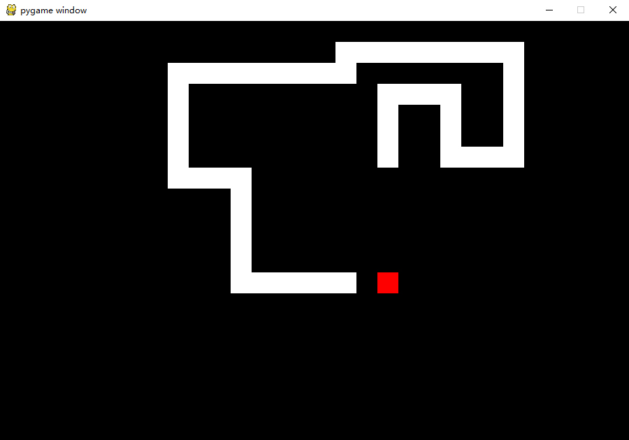

# 贪吃蛇
基于python实现的贪吃蛇
## 运行
```
pip install pygame
python3 main.py
```

## 操作
WSAD或↑↓←→键进行上下左右移动
## 个性化
在settings.py可以更改设置
```python
self.block_size = 30                    # 方块大小，影响屏幕大小
self.block_space = 0                    # 方块间距，影响屏幕大小

self.board_size = (30, 20)              # 面板大小

self.block_color = (255, 255, 255)      # 蛇颜色
self.food_color = (255, 0, 0)           # 食物颜色
self.background = (0, 0, 0)             # 背景颜色

self.snake_speed = 100                  # 蛇速度，单位毫秒
```